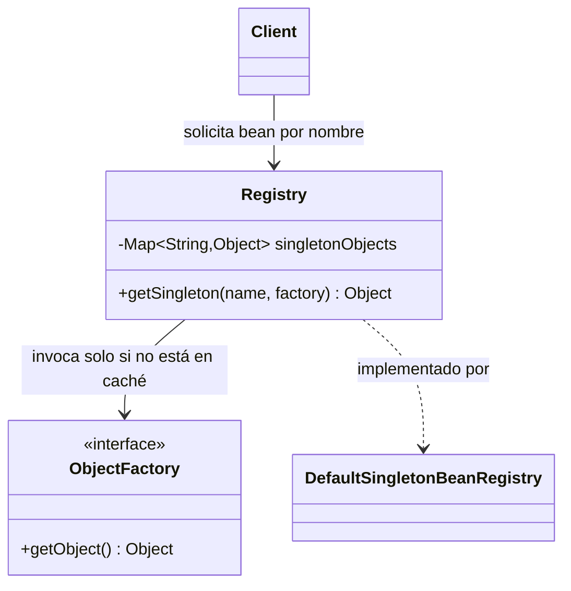
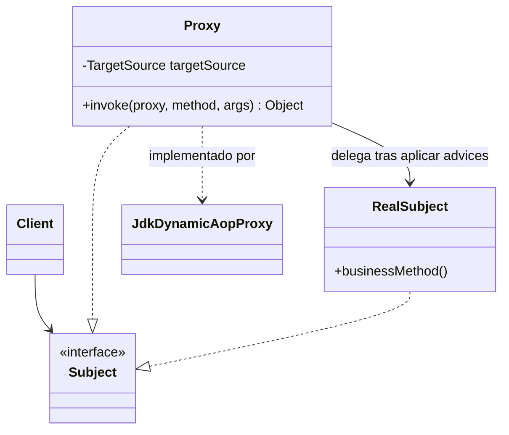
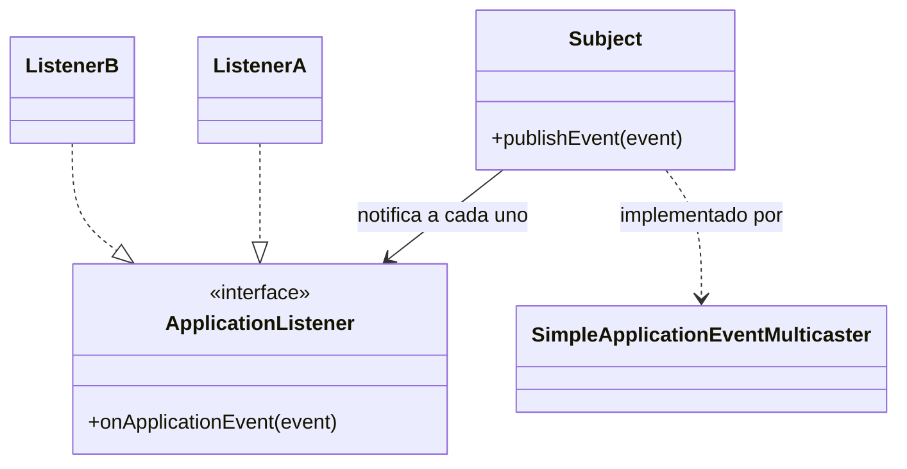

# Análisis de Patrones GoF en Spring Framework

## 1. Portada

**Nombre:** Juan Pablo Guerrero Hernández
**Código:** [completar código de estudiante]
**Curso:** Patrones de Diseño de Software
**Unidad:** Unidad 1 — Fundamentos de Patrones de Diseño y Buenas Prácticas
**Fecha:** 27 de agosto de 2026

---

## 2. Introducción

El presente documento analiza tres patrones de diseño del catálogo Gang of Four
(GoF) identificados en el código fuente real de Spring Framework, con el
propósito de comprender cómo un framework maduro y ampliamente utilizado en la
industria aplica de manera sistemática estos patrones para resolver problemas
concretos de diseño, y de conectar cada decisión de implementación con los
principios SOLID que refuerza. Spring Boot, construido sobre Spring Framework,
se toma como caso de estudio porque su arquitectura de contenedor de
inversión de control (IoC), su módulo de programación orientada a aspectos
(AOP) y su modelo de eventos son ejemplos particularmente claros de patrones
GoF aplicados a escala de producción. El análisis se apoya directamente en el
código fuente publicado en el repositorio oficial `spring-projects/spring-framework`
en GitHub, evitando descripciones genéricas de los patrones y priorizando la
evidencia concreta de clases, paquetes y métodos reales del framework.

Se seleccionaron tres patrones pertenecientes a las tres categorías GoF
distintas —creacional, estructural y de comportamiento— con el fin de mostrar
que Spring no recurre a un único tipo de patrón, sino que combina soluciones
de creación, composición y comunicación de objetos según el problema que
enfrenta en cada capa del framework: la gestión del ciclo de vida de los
beans, la interceptación de llamadas a métodos para funcionalidades
transversales, y la propagación de eventos dentro del contenedor de
aplicación.

## 3. Análisis de Patrón 1 — Singleton (Creacional)

*Diagrama conceptual: el `Client` nunca construye el objeto directamente; siempre
pasa por el `Registry`, que devuelve la misma instancia cacheada en llamadas
sucesivas.*

El patrón Singleton pertenece a la categoría creacional del catálogo GoF y su
propósito general es garantizar que una clase tenga una única instancia
accesible desde un punto de acceso global, controlando así la creación del
objeto en lugar de dejarla librada a que cada consumidor construya su propia
copia (Gamma et al., 1994). En Spring Framework, este patrón aparece de forma
explícita en la clase `org.springframework.beans.factory.support.DefaultSingletonBeanRegistry`,
perteneciente al módulo `spring-beans`, que es la implementación de referencia
utilizada por el contenedor IoC para gestionar el ciclo de vida de los beans
cuyo *scope* es `singleton` —el ámbito por defecto de cualquier bean definido
en un contexto de Spring—.

El problema específico que resuelve este patrón en Spring Boot es evitar que
el contenedor cree una nueva instancia de un mismo bean cada vez que dicho
bean es requerido para inyección de dependencias, lo cual sería costoso en
memoria y, más importante aún, rompería la coherencia del estado compartido
que muchos beans de infraestructura necesitan mantener (por ejemplo, un
`DataSource` o un `ApplicationContext`). Una alternativa directa —construir el
objeto en el punto de uso con `new`— obligaría a cada clase cliente a conocer
cómo se construye la dependencia y eliminaría la posibilidad de que el
contenedor gestione centralizadamente su ciclo de vida, sus dependencias y su
destrucción. `DefaultSingletonBeanRegistry` resuelve esto manteniendo un
`Map<String, Object>` (`singletonObjects`) que actúa como caché de instancias
por nombre de bean: el método `getSingleton(String beanName, ObjectFactory<?> singletonFactory)`
primero consulta el caché y solo invoca la fábrica del bean si la instancia
no existe todavía, registrando el resultado antes de devolverlo. Todas las
solicitudes posteriores para el mismo nombre de bean reciben la misma
referencia de objeto, tal como muestra el extracto de código documentado en
[`evidencia/01-singleton-DefaultSingletonBeanRegistry.md`](evidencia/01-singleton-DefaultSingletonBeanRegistry.md).

Este patrón refuerza principalmente el **Principio de Responsabilidad Única
(SRP)**, porque separa la responsabilidad de *gestionar el ciclo de vida y la
identidad de un objeto* (que recae en el registro de singletons del
contenedor) de la responsabilidad de *implementar la lógica de negocio* del
bean en sí. Ninguna clase de negocio necesita contener código de control de
instancias; esa responsabilidad queda completamente delegada al contenedor,
lo que mantiene cada clase enfocada en una única razón para cambiar.

## 4. Análisis de Patrón 2 — Proxy (Estructural)

*Diagrama conceptual: `Client` invoca métodos sobre `Subject` sin saber si habla
con el `Proxy` o con el `RealSubject`; el `Proxy` intercepta la llamada, ejecuta
comportamiento transversal (advices) y luego delega.*

El patrón Proxy pertenece a la categoría estructural del catálogo GoF y su
propósito general es proporcionar un objeto sustituto o representante que
controla el acceso a otro objeto, interponiéndose entre el cliente y el
objeto real para agregar comportamiento adicional sin que el cliente lo note
(Gamma et al., 1994). En Spring Framework este patrón se materializa en el
módulo `spring-aop`, concretamente en la clase
`org.springframework.aop.framework.JdkDynamicAopProxy`, que implementa las
interfaces `AopProxy` e `InvocationHandler` de la API estándar de proxies
dinámicos de Java (`java.lang.reflect.Proxy`). Esta clase es una de las dos
estrategias que Spring AOP utiliza para construir proxies —la otra es CGLIB,
para clases sin interfaz— y es la base sobre la que funcionan anotaciones tan
usadas en Spring Boot como `@Transactional`, `@Cacheable`, `@Async` o
`@Secured`.

El problema específico que resuelve es cómo aplicar comportamiento
transversal (*cross-cutting concerns*: transacciones, seguridad, caché,
registro de auditoría) a un bean sin obligar a que la clase de negocio
contenga ese código mezclado con su lógica propia. Una alternativa directa
—escribir manualmente el código de apertura/cierre de transacción o de
verificación de permisos dentro de cada método de negocio— duplicaría ese
código en decenas de clases y acoplaría fuertemente la lógica de dominio con
preocupaciones de infraestructura. `JdkDynamicAopProxy` resuelve esto
interceptando cada invocación a través de su método
`invoke(Object proxy, Method method, Object[] args)`: en lugar de que el
cliente llame directamente al objeto real (`target`), llama al proxy, que
primero recopila la cadena de *advices* aplicables al método
(`getInterceptorsAndDynamicInterceptionAdvice`) y, si existen, los ejecuta
antes de delegar —mediante `invocation.proceed()`— al objeto real. El cliente
obtiene el proxy a través de `getProxy(ClassLoader)`, que internamente llama a
`Proxy.newProxyInstance(...)`, de modo que el objeto devuelto implementa
exactamente las mismas interfaces que el objeto original y resulta
indistinguible de él desde el punto de vista del código cliente, tal como
documenta el extracto en
[`evidencia/02-proxy-JdkDynamicAopProxy.md`](evidencia/02-proxy-JdkDynamicAopProxy.md).

Este patrón refuerza principalmente el **Principio de Responsabilidad Única
(SRP)** y el **Principio Abierto/Cerrado (OCP)**: SRP, porque la
funcionalidad transversal (transacciones, seguridad, caché) queda separada de
la lógica de negocio del bean interceptado, cada una con su propia razón para
cambiar; y OCP, porque es posible agregar nuevo comportamiento transversal
(nuevos *advices*) sin modificar ni el código del proxy ni el código de la
clase de negocio, simplemente registrando un nuevo interceptor en la cadena.

## 5. Análisis de Patrón 3 — Observer (Comportamiento)

*Diagrama conceptual: el `Subject` (multicaster) recorre todos los
`ApplicationListener` registrados y notifica a cada uno, sin conocer sus
clases concretas (`ListenerA`, `ListenerB`).*

El patrón Observer pertenece a la categoría de comportamiento del catálogo
GoF y su propósito general es definir una dependencia de uno-a-muchos entre
objetos, de modo que cuando un objeto (el sujeto) cambia de estado o publica
un evento, todos sus dependientes (los observadores) sean notificados y
actualizados automáticamente, sin que el sujeto necesite conocer los detalles
concretos de cada observador (Gamma et al., 1994). En Spring Framework este
patrón aparece en el módulo `spring-context`, en el mecanismo de eventos de
la aplicación compuesto por la interfaz `org.springframework.context.ApplicationListener`
(el observador) y la clase
`org.springframework.context.event.SimpleApplicationEventMulticaster` (el
sujeto/publicador concreto), que Spring Boot expone a los desarrolladores a
través de `ApplicationEventPublisher.publishEvent(...)` y de la anotación
`@EventListener`.

El problema específico que resuelve es cómo permitir que distintas partes de
una aplicación reaccionen a un mismo suceso (por ejemplo, que el contexto de
Spring haya terminado de inicializarse, o que se haya creado un nuevo
usuario) sin que el componente que origina el evento tenga que conocer, de
antemano, ni la cantidad ni la identidad de los componentes interesados en
reaccionar. Una alternativa directa —que el componente publicador invoque
manualmente un método en cada componente interesado— crearía un acoplamiento
directo entre el publicador y todos sus consumidores, y cada vez que se
agregara un nuevo consumidor habría que modificar el código del publicador.
`SimpleApplicationEventMulticaster` resuelve esto a través de su método
`multicastEvent(ApplicationEvent event, ResolvableType eventType)`, que
recorre la colección de `ApplicationListener` registrados y compatibles con
el tipo del evento (obtenida con `getApplicationListeners(event, type)`) e
invoca el método `onApplicationEvent(event)` de cada uno —de forma síncrona o
a través de un `Executor` si el listener declara soporte para ejecución
asíncrona—, tal como se documenta en
[`evidencia/03-observer-SimpleApplicationEventMulticaster.md`](evidencia/03-observer-SimpleApplicationEventMulticaster.md).
El publicador del evento nunca referencia directamente a los listeners
concretos: solo conoce la abstracción `ApplicationListener`.

Este patrón refuerza principalmente el **Principio Abierto/Cerrado (OCP)** y
el **Principio de Inversión de Dependencias (DIP)**: OCP, porque es posible
agregar nuevos `ApplicationListener` que reaccionen a un evento existente sin
modificar el código del componente que publica ese evento; y DIP, porque
tanto el publicador como el multicaster dependen únicamente de la abstracción
`ApplicationListener` y no de las clases concretas que la implementan, lo que
invierte la dependencia que existiría si el publicador tuviera que conocer
directamente a cada consumidor.

## 6. Conclusiones

El análisis de `DefaultSingletonBeanRegistry`, `JdkDynamicAopProxy` y
`SimpleApplicationEventMulticaster` evidencia que Spring Framework no aplica
los patrones GoF como un ejercicio académico aislado, sino como soluciones de
ingeniería a problemas reales y recurrentes de su propia arquitectura:
controlar la identidad y el ciclo de vida de los objetos gestionados por el
contenedor (Singleton), interceptar comportamiento transversal sin acoplar la
lógica de negocio a preocupaciones de infraestructura (Proxy), y desacoplar
la publicación de eventos de sus consumidores (Observer). En los tres casos
el patrón elegido no solo resuelve el problema puntual, sino que
sistemáticamente refuerza uno o más principios SOLID —particularmente SRP,
OCP y DIP—, lo que confirma que patrones de diseño y principios SOLID no son
temas independientes, sino dos niveles de la misma disciplina: los principios
describen las propiedades deseables de un buen diseño, y los patrones GoF son
soluciones probadas y nombradas para alcanzar esas propiedades en situaciones
concretas. La lección más relevante para el diseño propio es que un patrón
GoF debe adoptarse cuando resuelve un problema real de acoplamiento o de
extensibilidad —como se hizo en la Parte 1 de este post-contenido al aplicar
Strategy e inyección de dependencias sobre `OrderProcessor`— y no como una
decisión estética o prematura.

## 7. Referencias

Gamma, E., Helm, R., Johnson, R., & Vlissides, J. (1994). *Design patterns:
Elements of reusable object-oriented software*. Addison-Wesley.

Refactoring.Guru. (s.f.). *Design patterns*. Recuperado el 27 de agosto de
2026, de https://refactoring.guru/design-patterns

Spring Framework contributors. (2026). *Spring Framework* [Código fuente].
GitHub. https://github.com/spring-projects/spring-framework

VMware, Inc. (2026). *Spring Framework documentation*. Spring Docs.
https://docs.spring.io/spring-framework/reference/

VMware, Inc. (2026). *Spring Boot reference documentation*. Spring Docs.
https://docs.spring.io/spring-boot/reference/
